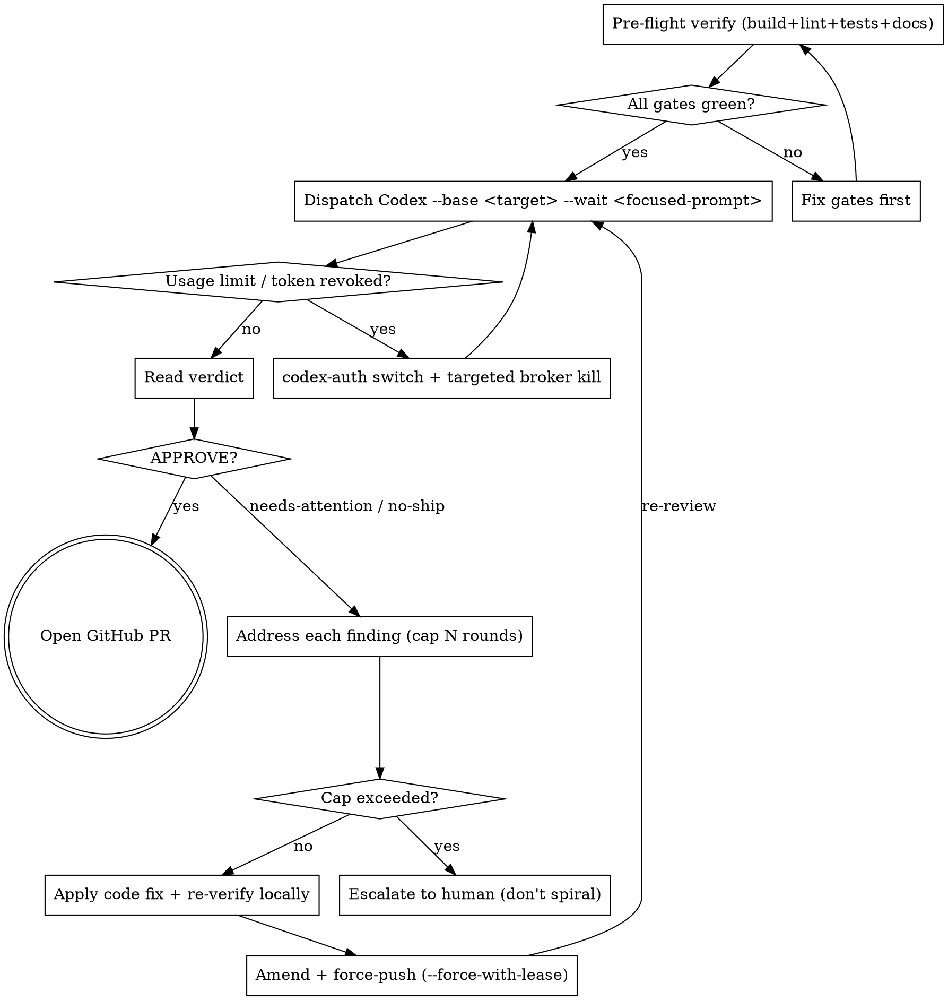

> Workflow skill — not a Rust-API convention like [`rust-type-conventions`](../rust-type-conventions/SKILL.md). The verify gates shown are Rust/cargo-flavored; the loop shape (dispatch → verdict → fix → re-dispatch → APPROVE-then-PR) and the multi-account `codex-auth` switch procedure generalize to any language.

# Codex Adversarial Review Loop

**Use when:** you want strong third-party review of in-progress code before exposing it to GitHub PR-level reviewers (Copilot, human). The loop catches systemic defects (typed-error / contract violations, allocation-discipline issues, parser-coverage gaps, FFI/UB bugs) that local linters and unit tests don't reach.

**Output:** a Codex `APPROVE` verdict on the current branch HEAD, then open the PR.

**Why this beats "just open the PR":** every Copilot / human review round costs 30+ minutes per PR. Driving Codex to `APPROVE` locally first compresses 4-6 review rounds into 1, and Codex finds defect classes that PR-side reviewers usually miss (cross-finding regressions, coverage gaps, allocation-discipline violations).

## When NOT to use

- Trivial PRs (1-2 file changes, no new types, no new public API) — go straight to PR.
- Stacked PRs where each layer is itself small — combine into one branch first, then run the loop on the combined diff.
- Pure dependency-bump PRs.

## The Loop



## Pre-flight verify gates (MUST all be exit 0 before each Codex dispatch)

Codex runs in a read-only sandbox — it can't compile your code. If your local build is broken, Codex wastes its turn diagnosing the build failure instead of substance. Always confirm green LOCALLY first.

Pick the verify suite that matches the project's language / build system. For a Rust crate it's typically:

```bash
# Isolate the build cache so the loop doesn't churn shared target/.
export CARGO_TARGET_DIR=<isolated-target-dir>
# Optional but recommended: warm the cache across iterations.
# export RUSTC_WRAPPER=<sccache-binary>

cargo fmt
cargo fmt --check                                                ; fmt=$?
cargo clippy --all-features --tests --no-deps -- -D warnings     ; clippy=$?
cargo test --all-features --lib --no-fail-fast -- "<filter>"     ; test_lib=$?
RUSTDOCFLAGS="-D warnings" cargo doc --all-features --no-deps    ; doc=$?
cargo hack clippy -p <crate> --each-feature --no-deps --tests -- -D warnings ; hack=$?
echo "fmt=$fmt clippy=$clippy test=$test_lib doc=$doc hack=$hack"
```

Adapt for other ecosystems: replace with the equivalent build / lint / test / docs / matrix-coverage commands and capture each exit code.

### Exit-code discipline (3 hard rules)

These three patterns have all silently shipped broken code in the past:

1. **`; var=$?` after EACH command — never pipe-and-trust.** `cmd | tail -5; var=$?` captures `tail`'s exit, not `cmd`'s. `${PIPESTATUS[0]}` is bash-only and breaks under zsh. Just don't pipe.

2. **Capture per-test-invocation, not at the end of a chain.** If your verify script runs `cargo test` (or equivalent) more than once, capture the exit code AFTER EACH ONE:
   ```bash
   # WRONG — masks the first test failure if the second one passes:
   cargo test --lib -- "<filter>"
   cargo test --test <integration-binary>
   test_exit=$?                                  # only reflects the LAST cargo test

   # RIGHT:
   cargo test --lib -- "<filter>"                ; test_lib=$?
   cargo test --test <integration-binary>        ; test_int=$?
   echo "test_lib=$test_lib test_int=$test_int"
   ```

3. **Cargo's `--test <name>` runner-arg separator.** Args like `--test-threads=1` / `--nocapture` are libtest-runner args, not cargo args — they MUST come after `--`:
   ```bash
   cargo test --test <integration-binary> --test-threads=1     # WRONG — cargo rejects
   cargo test --test <integration-binary> -- --test-threads=1  # RIGHT
   ```
   The wrong form returns exit 1 with an arg-parse error that LOOKS like a test failure but isn't.

## Dispatching Codex

```bash
node "<plugin-cache>/openai-codex/codex/<ver>/scripts/codex-companion.mjs" adversarial-review \
  "--base <target-branch> --wait <FOCUSED PROMPT>"
```

Flags:
- `--base <ref>` — review the diff `ref...HEAD` (not just working-tree). Almost always your trunk branch (`main` / `master`).
- `--wait` — block until Codex finishes (synchronous). Use this for the iteration loop. The async equivalent (`--background`) is for fire-and-forget cases where you have other independent work.

## Prompt construction (the single most important thing)

The Codex prompt is a **double-quoted shell argument**. Three rules — each has burned this workflow before:

1. **ZERO shell metacharacters.** No backticks, no `$()`, no `${var}`, no bare `$`. The shell eats them before they reach Codex. Use plain English: write *"the FileIo variant"* not *"the `FileIo` variant"*.

2. **Foreground the focus order**, otherwise Codex nitpicks doc wording and ignores substantive defect classes:
   ```
   PRIMARY FOCUS in order: algorithmic correctness, memory safety, memory leaks, UB;
   then datarace, panic-OOM, FFI, unsafe; then scope fence.
   ```

3. **End with a SCOPE FENCE** that names exactly which files / branches are in-scope. Without it, Codex WILL raise findings on out-of-diff pre-existing code:
   ```
   SCOPE FENCE: only <path-glob-1> + <path-glob-2>.
   ```

### Prompt template

```
--base <target> --wait
Adversarial review of <branch-or-PR identifier> R<round>+<sub> following <prior verdict + fix summary>.

PRIMARY FOCUS in order: algorithmic correctness, memory safety, memory leaks, UB;
then datarace, panic-OOM, FFI, unsafe; then scope fence.

CHANGE SUMMARY:
- (1) <specific change A, with file:line cites>
- (2) <specific change B>
- ...

CHECK:
- did <specific invariant 1> hold after the fix
- does <specific defect class 2> recur elsewhere in scope
- any <category 3> regression
- ...

SCOPE FENCE: only <exact paths>; <unrelated work> explicitly out of scope.
```

### Round-N prompt addendum

For iterations after R1, prefix CHANGE SUMMARY with the prior round's finding + your fix:

```
R<N-1> FINDING ADDRESSED: <one-line verbatim finding text>
FIX APPLIED: <one-line code-change description>
```

This anchors Codex on the specific defect being re-checked, not the whole PR.

## Iteration discipline

| Round | Behavior |
|---|---|
| R1 | Cold dispatch — full prompt, no prior history. Expect a comprehensive findings list. |
| R2-R5 | Address each R(N-1) finding individually. Preserve OTHER fixes (don't drop them). Each fix amended into the SAME commit (one PR = one squashed commit). |
| **R6 (CAP)** | If Codex returns `needs-attention` at R6, **STOP**. Recurring defect class means the design is wrong, not the fix. Escalate to a human + propose a structural change. |

**Iterating ≠ spiraling.** If R(N) finds the same defect class as R(N-1) just relocated, that's a signal to redesign, not to patch the new occurrence.

## After each fix: amend + push (NOT new commit)

```bash
git add -A                              # CRITICAL: always add before amend
git status --porcelain                  # must be EMPTY after add
git commit --amend --no-edit
git log --oneline -1                    # verify amend landed
git push --force-with-lease origin <branch>
```

- **Why `--amend`:** PRs squash-merge to one commit anyway, so iterating with `git commit -m "fix R2"` just creates noise that gets squashed away. Amending keeps the commit message clean.
- **Why `--force-with-lease`:** safer than `--force` if a teammate happens to push to the same branch — the lease is free insurance.
- **Always `git add -A` BEFORE `--amend`:** `git commit --amend` without preceding `git add` drops unstaged worktree fixes. Assert `git status --porcelain` is empty after `add`.

## After APPROVE: open the PR

```bash
gh pr create --base <target> --head <branch> \
  --title "<conventional commit subject>" \
  --body "<scope summary + verify status + Codex APPROVE note>"
```

PR body should include:
- One-paragraph scope summary
- The verify status (`fmt=0 clippy=0 test=0 doc=0 hack=0` or equivalent)
- `Codex adversarial review: APPROVE (R<N>, no material findings)`
- Reference to companion PRs if this is one of a stacked / parallel set

## Anti-patterns

Each has cost this workflow ≥ 1 wasted round — never repeat:

| Anti-pattern | What broke |
|---|---|
| Pipe-and-trust exit code | Verify "passed" while clippy actually failed → pushed broken code to origin |
| Single `test_exit=$?` across multiple `cargo test` runs | First test's failure masked when the next test passed → CI red after a "verify-green" push |
| `cargo test --test <name> --test-threads=1` (missing `--` separator) | Cargo arg-parser rejects `--test-threads`, returns exit 1 — looks like a test failure but is actually never-ran |
| Shell metachars in Codex prompt | Backticks eaten by zsh → Codex turn produced garbage verdict |
| `cargo test -- <filter>` without targeted module path | Filter matched 0 tests; `0 passed; X filtered out` reported as green |
| Amend without `git add -A` first | Fix was in worktree but not in commit → next Codex round reviewed unchanged code |
| Spiraling past ~4 rounds on the same defect class | Each patch opens a new edge case; root design is wrong |
| Treating reviewer finding as gospel without verification | Reviewer raised a finding on out-of-diff pre-existing code; verify it's actually in `git diff base...HEAD` before fixing |
| Running the loop on a stacked PR's child | Reviewer raises findings on the parent PR's code that aren't your concern; combine first |
| Dispatching the iteration loop via a subagent | Subagents lose context across the loop and may abort mid-await; run from a single controller shell |

## Codex account switch on usage / token failure

The Codex pool is typically **multiple accounts** registered via `codex-auth`, each rate-limited (5-hour + weekly caps). Hitting either cap or a revoked refresh-token returns an error in place of a verdict — the loop has to switch accounts and re-dispatch.

**Trigger shapes** (Codex returns one of these instead of a normal `verdict: …` line):

| Error text | What it means | What to do |
|---|---|---|
| `You've hit your usage limit. … try again at <time>` | 5h or weekly cap on the active account | round-trip to next account |
| `Your access token could not be refreshed because your refresh token was revoked. Please log out and sign in again.` | token revoked (account shows `401` in `codex-auth list`) | skip this account permanently until manual re-auth |
| `Your access token could not be refreshed because you have since logged out or signed in to another account.` | concurrent session re-auth invalidated the broker's cached token | retry on the same account after switching this session's broker |

**Procedure (every trigger):**

```bash
# 1. List the pool. Usage percentages shown are ADVISORY — they lag actual broker
#    state. Note which accounts are `401` (revoked, skip until re-auth) and which
#    look freshest on 5h + weekly.
codex-auth list

# 2. Switch to the account that looks freshest. Use the email — numeric shortcuts
#    (`01`, `02`, …) are rejected with "error: no account matches".
codex-auth switch <email>

# 3. Kill ONLY this session's stale broker(s). Brokers cache the failed account's
#    token; only a fresh broker picks up the switched account. Identify by
#    `--cwd <YOUR-worktree>` in the broker arg list:
ps -eo pid,command \
  | grep "broker.*<your-worktree-pattern>" \
  | grep -v grep \
  | awk '{print $1}' \
  | xargs kill

# 4. Retry the Codex dispatch.
```

### Scope the kill carefully

Other concurrent agent sessions (in unrelated worktrees) have their own brokers; **their brokers do NOT cache YOUR failed account's token**. Killing them disrupts unrelated work for no benefit.

- ALWAYS grep `--cwd <YOUR worktree>` in the broker arg list before piping to `kill`.
- `pkill -f codex-broker` (no scope) is a footgun — never use it.

### `codex-auth list` is advisory only

Usage percentages can lag the broker's actual rejection (account shows `0%` 5h cap but broker returns `usage limit hit`). The **only reliable test is to actually try the account**. If a switch-and-retry fails again with usage-limit / revoked-token, go back to step 1 and try the NEXT non-`401` account regardless of percentages. Cycle through every non-`401` account empirically before concluding the pool is exhausted.

### Empirically-exhausted fallback

If every non-`401` account fails (you tried each and got usage-limit / revoked), **WAIT** for the soonest reset shown in `codex-auth list`. Round-trip is genuinely exhausted; further kill-and-retry won't help. Queue the deferred Codex review for after the reset window; continue any in-flight non-Codex work in the meantime.

Do NOT preemptively prompt the user to re-auth `401` accounts unless every non-`401` account has been empirically tried AND the next reset is hours away.

### Reactive, not preemptive

Only switch when Codex actually reports a failure. Don't switch "just to be safe" before a long run — the usage you'd "save" on the old account is lost on the new one, and you've burned a credential rotation with nothing to show.

### Maintenance aside (unrelated to the switch)

A large `~/.codex/logs_*.sqlite` (multi-GB) has been observed causing intermittent `failed to load configuration` errors. Rotate / clear Codex logs as a separate maintenance item — don't bundle it into the switch procedure.

## Bottom line

**Drive Codex to APPROVE locally before opening the PR.** The loop costs 30-90 min; opening a PR cold and round-tripping through GitHub-side Copilot / human review costs 2-3+ hr — and the local loop catches stronger defects (systemic-class issues) that PR-level review usually misses.
